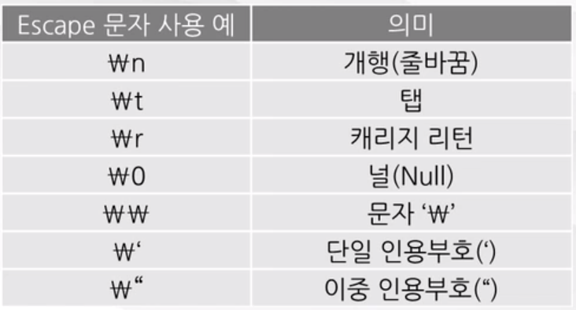
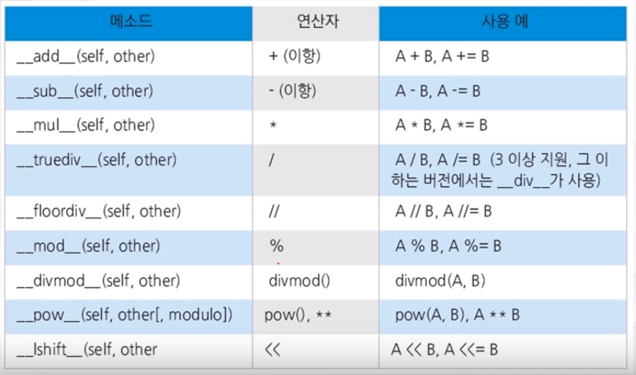
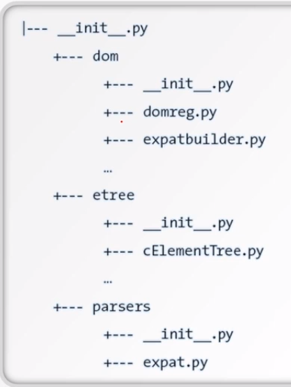

### Python 이란?
- 바로가기
    - <a href="#python">파이썬이란?</a>
    - <a href="#pythonspec">파이썬의 종류</a>
    - <a href="#pythonversion">파이썬 버젼</a>
    - <a href="#pythongrammar">파이썬 문법</a>
    - <a href="#dataandoperator">파이썬 자료형 및 연산자</a>
    - <a href="#function">파이썬 함수</a>
    - <a href="#control">제어문</a>
    - <a href="#class">클래스</a>
    - <a href="#module">모듈</a>

- <b id="python">파이썬</b>
    - 1991년 귀도 반 로썸이 발표
    - 특징
        - 가독성 높음(간결, 코드 block을 들여쓰기로 구분)
        - 풍부한 Library
        - 접착성 : 간단하게 library 추가, C로 구현된 부분 사용 가능
        - 무료
        - 유니코드 : 문자열 모두 유니코드
        - 동적타이핑 : 런타임 시에 타입 체크 하는 동적타이핑 지원, 메모리 관리 자동
- <b id="pythonspec">파이썬의 종류</b>
    - Cpython
        - C로 구성된 Python
    - Jython
        - 자바로 구성된 Python
        - 자바 가상 머신에서 구동 가능
        - 자바 library를 지원함
    - IronPython
        - .NET용으로 C#으로 구현된 Python
    - Pypy
        - Python 으로 구현된 Python
- <b>파이썬으로 진행된 Project</b>
    - 
- <b id="pythonversion">파이썬의 Version</b>
    - 2.x style
        - print
            - ex) print "welcome to", ---
        - int/int가 int의 결과로 반영되었음
        - String, Unicode로 구분
    - 3.x style
        - 2 version과의 호환성이 전혀 없음
        - print가 함수형태로 변경
            - ex) print("welcome")
        - long 자료형이 없어지고 int형으로 통일
        - int/int의 결과가 float으로 처리됨.
        - String / bytes로 구분(Unicode를 따로 지정하지 않고 일반 String이 기존 Unicode)
- <b id="pythongrammar">파이썬의 문법</b>
    - 들여쓰기(indentation)
        - 가독성을 높일 수 있음. 그러나 오류가 발생하지 않도록 주의
        - 예약어 아래에 같은 구문 시, 예약어 뒤에 (:) 사용하여 구분
            - <pre><code>for i in Python: 
                &#32; &#32;print(i)
              </code></pre>
    - 주석(#)
        - ```-*- coding: utf-8-*-```
        - 위와 같이 사용 시, 소스코드 인코딩 지정하는 용도로 사용
    - 세미콜론(;)
        - 한 line에 복수의 구문 시 사용. 
            - ```a=1; b=2```
- <b id="dataandoperator">자료형과 연산자</b>
    - 자료형?
        - 프로그램이 연산을 수행하기 위해 임시로 저장한 저장소를 변수라고 하며 이 변수의 유형이 자료형
        - 수치형, 문자형, 리스트형, 튜플형, 사전(Dictionary)형, 부울형이 있다.
        - 변수?
            - 문자 / 숫자 / 밑줄(_)로 구성되며 예약어는 사용 불가하고, 대소문자를 구분하며 숫자를 먼저 대어 이름을 지을 수 없다.
        - 수치형
            - int와 float, complex가 있으며 int는 정수, float는 소수
            - int는 숫자 앞에 0x는 16진수, 0o는 8진수, 0b는 2진수이다.
            - float는 3.14또는 314e-2 지수형으로 표현할 수 있다.
            - complex는 복소수이며 imag는 허수부, real은 실수부, conjugate()는 켤레 복소수를 나타낸다.
        - 문자형
            - '', "", """ """ 등으로 사용 가능하며 기본적으로 유니코드이다. 유니코드 이외의 인코딩 시 bytes로 표현된다.
                - <pre><code>type('가'.encode('utf-8'))</code></pre>의 class type은 bytes이다.
            - Escape 문자 사용하여 표현 가능
                - 
            - +를 통해 문자열을 잇거나 *를 통해 반복화할 수 있다.
            - 인덱싱, 슬라이싱 또한 가능하다.
                - 'python'[0], 'python'[5], 'python'[1:4], 'python'[-2:] 등을 통해 특정 부분을 나타낼 수 있다.
        - 리스트형
            - 값의 나열과 같으며, 인덱싱, 슬라이싱이 가능하다.
            - 예) ['red', 'green', 'gold', 'black']
            - 특정 index에 추가하거나 확장할 수 있다.(insert, append, extend, +)
            - count를 통해 list의 개수를 알 수 있고 pop을 이용해 값을 뽑아내거나 remove로 삭제, sort로 정렬 가능
        - 세트
            - 값의 모임이며, 순서가 없다. 제공 메소드는 리스트와 유사하고 추가적으로 교집합(intersection)/합집합(union)이 제공된다.
        - 튜플
            - 리스트와 유사하나 읽기 전용이다. 읽는 속도는 빠르다. 제공되는 함수는 적다.
            - 자주 사용되는 것은 count, index 정도이다.
            - 리스트, 세트, 튜플은 상호간 생성자를 통해 변환 가능
        - 딕셔너리(사전)
            - 키 : 값의 쌍으로 이루어져 있다.
            - 예 : {'a' : 1, 'b' : 2, 'c' : 3}
            - items(), keys(), values() 메소드를 통해 키/값, 키, 값을 각각 반환할 수 있다.
            - del문을 이용해 삭제하거나 clear()를 통해 전체 삭제 가능
        - bool(부울)
            - True, False만 가능한 참 거짓 자료형
            - 논리연산 / 비교 연산의 결과로 활용한다.
            - 논리 연산자는 &, |, not이 있다. 비교는 >, <, !=, == 등이 있다.
            - 0은 false이며 다른 숫자는 true. 빈 문자열은 false, 값이 없는 상태인 공란도 false
    - 연산자
        - +,-,*,/,//,%,**,= 등이 있으며 //는 몫만 남기는 방식, **는 거듭제곱
    - 얕은 복사 vs 깊은 복사
        - 변수에는 객체의 주소가 저장된다.
        - 얕은 복사
            - a = [1,2,3], b=a 라고 한다면 동일한 리스트 객체를 공유하여 id(a), id(b)의 값은 동일하다.
            - 즉, 주소가 복사되어 객체를 공유하는 경우를 의미한다.
        - 깊은 복사
            - 객체를 공유하지 않는 복사 방식이다.
            - a = [1,2,3], b=a[:]라고 한다면 각각의 id값은 다르다. 이 때, a list내 element 값을 변경한다면 b는 변경되지 않는다.
- <b id="function">함수</b>
    - 함수란?
        - 여러 statement를 하나로 묶어서 실행할 수 있는 단위로 이미 정의되어 있는 것을 사용하거나 필요한 것을 정의
        - 1회 이상 호출 가능하며 종료 시 결과 값을 호출한다.
    - 선언
        - def로 선언하며 콜론(;)으로 종료.
        - 시작과 끝은 코드의 들여쓰기로 구분하며, 시작/끝은 명시하지 않아도 된다.
        - Header 파일로 나누거나 interface, implementation으로 나누지 않는다.
    - 예시
        - <pre><code>def <함수명>(인수1, 인수2, ... , 인수 N):
              &#32; <구문> # <-- 들여쓰기로 구분
              &#32; return <반환 값>
            </code></pre>
        - <pre><code>def Times(a, b):
            &#32; return a*b
        </code></pre>
    - 선언한 뒤 처리
        - 함수를 선언하면 메모리에 함수 객체가 생성되어 해당 객체를 가리키는 reference가 생성된다.
        - 해당 reference는 다른 변수에 할당 가능하다.
        - 예를 들어 위 ```Times``` 함수를 <pre><code>myTimes = Times</code></pre> 와 같이 사용한다면 myTimes를 이용해 함수를 호출할 수 있다.
            - <pre><code> r = myTimes(10, 10) </code></pre>
    - 반환 및 인수
        - return : 함수를 종료시키고 호출한 곳으로 돌아가게 한다.
            - 여러 개의 값을 튜플로 묶어 값 전달 가능
            - return을 사용하지 않거나 return 만 적어도 함수가 종료된다. 이 경우 리턴값은 None이다.
        - 인수
            - 레퍼런스를 이용해 전달되며 호출자 내부 객체의 레퍼런스이다.
            - 기본 인수
                - 함수 호출 시 인수 지정하지 않아도 기본 값이 할당 되게 지정
                - <pre><code> def Times(a=30, b=20):
                &#32; return a+b;</code></pre>
            - 키워드 인수
                - 인수 이름으로 값 전달. 변수 이름으로 특정 인수 전달이 가능하다.
                - <pre><code>def connectURI(server, port):
                &#32; str="http://" + server + ":" + port
                &#32; return str</code></pre>
            - 가변인수 리스트
                - 인수의 개수가 정해지지 않은 가변 인수 전달 가능. *를 사용해 인수는 튜플 형식 전달 
                - <pre><code> def Times(*ar):
                    &#32; for item in ar:
                    &#32; &#32; res.append(item)
                    return res;</code></pre>
            - 정의되지 않은 인수 처리
                - **를 사용해 정의되지 않은 인수를 Dictionary형식으로 전달할 수 있다.
                - <pre><code> def userURIBuilder(server, port, **user):
                &#32; str = "http://" + server + ":" + port + "/?"
                &#32; for key in user.keys():
                &#32; &#32; str += key + "=" + user[key] + "&"
                &#32; return str
                - <pre><code> userURIBuilder("test.com", "8080", id='userid', passwd='1234')
            - 호출자가 전달하는 변수의 타입에 따라 처리 방식이 다르다. 변수 타입은 다음과 같다
                - Mutable(변경 가능한 변수)
                - Immutable(변경 불가능한 변수)
            - 변경 불가능한 변수
                - 함수 1의 예시
                    - <pre><code>def sum1(x,y):
                        &#32; return x*y; </code></pre>
                - 함수 2의 예시
                    - <pre><code>def sum2(x,y):
                        &#32; x=1
                        &#32; return x + y; </code></pre>
                - a, b를 10, 20으로 초기화 후, 각각의 함수를 해당 인수를 전달하여 호출한다고 가정하자.
                - 이 때, sum1 함수는 x, y가 10,20 reference를 가리키게 되고, sum2에서는 x=1에 의해 x에 reference를 할당하게 된다.
                - 그러나 함수 내부에서 x=1 이라고 지정한 것이 이전에 x=10으로 지정했을 때 영향을 미치지는 않는다.
            - 변경 가능한 변수
                - 만약 ``` wordlist = ['J', 'A', 'M'] ```으로 지정한 뒤에 해당 리스트를 인자로 전달한 경우 내부에서 리스트 내 element를 변경 시, 해당 리스트 내의 값은 실제로 변경된다.
                - 그러나 내부에서 Deep Copy를 하여 새로이 reference를 할당해 변경한 경우, 외부에서 지정한 변수의 값에는 변경이 없다.
    - Scoping rule
        - 이름 공간(namespace)
            - 변수의 이름이 저장되는 장소
            - 함수 내부의 이름 공간, 지역 영역(Local Scope)
            - 함수 밖의 영역, 전역 영역(Global Scope)
            - 파이썬 자체에 정의에 의한 영역, 내장 영역(Built-in Scope)
        - LGB 규칙
            - 변수 이름을 찾을 때는 Local -> Global -> Built-in Scope 순서로 찾는다.
            - 지역 영역에서 전역 영역의 이름을 접근 시, global을 사용한다.
                - <pre><code>a = 10
                def sum(x): &nbsp; &#32; return x+a;</code></pre>
                - 위와 같이 지정 시 global에 있는 a를 찾게 된다.
    - 람다 함수
        - 이름이 없는 1줄 짜리 함수
            - ``` lambda 인수 : <구문> ```
        - 한 줄의 간단한 함수가 필요 시 사용하며, 프로그램의 가독성을 위해 사용하기도 한다.
        - 예
            - <pre><code> g = lambda x, y : x*y
            g(2,3)
            ---> 6
            (lambda x: x * x)(3)
            ---> 9</code></pre>
    - 재귀 함수
        - 함수 내부에서 자기 자신을 계속 호출하는 함수
        - 전달 인자를 변경하면서 연속적인 반복 연산 시에 유용
    - pass 구문
        - 아무 일도 하지 않고 넘긴다. 아무 것도 안하는 함수, 모듈, 클래스를 만들 경우 유용하게 사용
    - ```__doc__``` 속성과 help 함수
        - help 함수는 설명을 볼 수 있다.
            - ```help(print)```
            - 사용자가 만든 함수도 help를 사용해 설명을 볼 수 있다.
        - ```__doc__``` 속성을 이용해 더 자세한 설명을 추가할 수 있다.
            - ``` plus.__doc__ = "return the a+b"```
            - 위와 같이 plus 함수에 대한 설명을 더할 수 있다.
    - iterator
        - 순회 가능한 객체의 요소를 순서대로 접근할 수 있는 객체
        - 내부 반복문을 관리해 주는 객체
        - 내부의 ```__next__()```를 이용해 순회 가능한 객체의 요소를 하나씩 접근 가능하다.
        - 예)
            - <pre><code> s='abc'
            it = iter(s)
            it ---> <iterator object>
            next(it) ---> 'a'
            next(it) ---> 'b'
            it.__next__() ---> 'c'</code></pre>
    - generator
        - return 대신 yield 라는 구문을 이용해 함수 객체를 유지한 채 값을 호출자에 넘겨준다.
        - 값을 넘기고 함수 객체는 그대로 유지한다.
        - 함수의 상태를 그대로 유지하고 다시 호출할 수 있어 순회 가능한 객체를 만들 경우 유용하다.
        - 예)
            - <pre><code> def reverse(data):
            &#32; for index in range(len(data) - 1, -1, -1):
            &#32; &#32; yield data[index]
            for char in reverse('golf'):
            &#32; print(char) ---> f l o g가 순서대로 출력</code></pre>
        - 예2)
            - <pre><code> def abc():
            &#32; data ="abc"
            &#32; for char in data:
            &#32; &#32; yield char </code></pre>
        - abc를 출력하면 함수 객체, abc()를 출력하면 generator객체가 출력된다.
        - iterator를 이용해야 한다.
            - <pre><code> it = iter(abc())
            next(it) --> 'a'
            next(it) --> 'b'
            next(it) --> 'c'</code></pre>
- <b id="control">제어문</b>
    - if 문
        - 조건식을 평가하고 참인 경우만 구문 수행
        - 2개 이상 구문은 들여쓰기로 블록 지정하여 함수와 동일하며 들여쓰기 정도는 파일 전체를 통일 시킨다.
        - elif와 else를 이용해 다양한 조건을 구성할 수 있다.
        - 조건식의 판단은 자료형의 bool 값과 동일하게 True/False로 판단한다.
            - False는 0, 0.0, (), [], {}, None, '' 인 경우에도 그러하다.
        - and / &, or / |를 통해 조건식을 활용할 수 있다.
        - 구조
            - <pre><code> if <조건식>:
            &#32; <구문> 
            elif <조건식2>:
            &#32; <구문2>
            else
            &#32; <구문3></code></pre>
        - 단축 평가
            - 조건식 전체가 아닌 순차적 진행 시, 식 전체가 자명하다면 더 이상 수식을 평가하지 않는 방법
            - x and y라면 x가 False 시, y는 평가 하지 않고, x or y라면 x가 True 시 y는 평ㅇ가하지 않는다.
            - 이를 통해 연산 속도를 향상시키고 Run time error 발생을 사전에 차단할 수 있다.
    - while 문
        - 조건식이 참인 동안 내부 구문을 반복하여 수행한다.
        - 구조
            - <pre><code> while<조건식>:
            &#32; <구문>
            &#32; else:
            &#32; &#32 <구문></code></pre>
    - for 문
        - 시퀀스형 객체를 순차적으로 순회
        - else
            - 반복문 도중 break 인해 중간에 종료되지 않고 끝까지 수행된 경우 수행된다.
        - 구조
            - <pre><code> for <아이템 I> in <시퀀스형 객체 S>:
            &#32; <구문></code></pre>
        - for문에는 문자열, 리스트, 튜플, 사전 자료형 객체와 이터레이터/제너레이터 객체를 사용할 수 있다.
        - while / for문은 중첩하여 사용 가능하다.
    - break 문
        - 반복문 내에서 벗어날 수 있도록 지정하는 구문
    - continue 문
        - 반복문 내부 블록을 수행하지 않고 다음 item을 선택해 내부 블록의 시작 지점으로 이동하여 반복문을 지속 수행
    - 리스트 내장
        - ```[<표현식> for <아이템> in <시퀀스 객체> (if <조건식>)]```
            - 예 :
                - ```L_1 = [3,4,5], L_2=[1.5, -0.5, 4]```
                - ```[x*y for x in L_1 for y in L_2]```
                    - [4.5, -1.5, 12, 6.0, -2.0, 16, 7.5, -2.5, 20]
        - 기존 시퀀스 객체를 이용해 추가적인 연산을 통해 새로운 리스트 객체 생성
    - 제어문 응용 함수
        - ```filter(<function> | None, 시퀀스 객체)```
            - 함수의 결과 값이 참인 시퀀스 객체의 이터레이터 반환
            - None이 오는 경우 필터링하지 않는다.
            - 예
                - <pre><code> L = [10, 25, 30]
                  IterL = fillter(None, L)
                  for i in IterL:
                    &#32; print("Item: {0}".format(i))
                  Item: 10 
                  Item: 20
                  Item: 30
                  def GetBiggerThan20(i):
                    &#32; return i > 20
                  list(filter(GetBiggerThan20, L)) ---> [25, 30]</code></pre>
        - ```range(['시작값'], '종료값'[,'증가값'])```
            - 수열을 순회하는 이터레이터 객체 반환
            - 시작 값과 증가 값은 생략 가능하며, 이 때는 각 0, 1 할당
            - 예
                - <pre><code> list(range(10)) #종료값만 잇는 경우 - 10은 미포함
                [0, 1, 2, 3, 4, 5, 6, 7, 8, 9]
                list(range(5, 10)) # 시작값, 종료값
                [5, 6, 7, 8, 9]
                list(range(10, 0, -1)) # 시작값, 종료값, 증가값
                [10, 9, 8, 7, 6, 5, 4, 3, 2, 1]
                list(range(10, 20, 2)) # 10부터 20까지 짝수
                [10, 12, 14, 16, 18]</code></pre>
        - ```map(<funccton>, 시퀀스 객체, ...)```
            - 시퀀스 객체를 순회하며 function의 연산 수행
            - 함수의 인자 수만큼 시퀀스 객체 전달
            - 예
                - <pre><code>L=[1, 2, 3]
                def Add10(i):
                &#32; return i+10
                for i in map(Add10, L):
                &#32; print("Item: {0}".format(i))</code></pre>
            - 위 예시는 각 item이 10씩 더해져서 출력된다.
- <b id="class">클래스</b>
    - 개념
        - 데이터와 데이터를 변형하는 함수를 같은 공간에 작성할 수 있다.
        - 이를 통해 객체 지향 언어처럼 구현할 수 있다.
    - 용어 개념
        - 메서드
            - Class 이름 공간에 속한 함수
        - 인스턴스
            - 하나의 객체를 의미함.
        - 정보 은닉(information hiding)
            - 내부에 정의된 데이터, 함수를 외부에서 접근할 수 없도록 한다.
        - 추상화
            - 각 Class에서 공통 부분을 묶어 공통 class로 만들 수 있다.
        - 다형성
            - 같은 부모 함수를 상속받아 다른 행위를 수행할 수 있다.
    - 예시
        - <pre><code> class Person: # 클래스 정의
        &#32; Name = "default Name" # 멤버변수
        &#32; def print(self): # 멤버 메소드
        &#32; &#32; print("My Name is {0}".format(self.Name))
        p1 = Person() # 인스턴스 객체 생성
        p1.print() # 멤버 변수 값 출력</code></pre>
        - 위 예시 처럼, p1 인스턴스는 Person 클래스를 참조하는 reference가 된다.
    - 클래스와 인스턴스 이름 공간
        - 검색 순서
            - 인스턴스 객체 영역
            - 클래스 영역
            - 전역 영역
        - 멤버 데이터 추가
            - <pre><code> Person.title = "New title" # Class 객체에 새로운 멤버 변수 title 추가
            p1.age = 20 # p1 인스턴스 객체에만 age 멤버 변수 추가</code></pre> 
            - 만약 p2의 인스턴스에서 age를 출력하고자 하면 error가 발생한다.
        - 클래스와 인스턴스 관계
            - isinstance(인스턴스 객체, 클래스 객체)
                - 인스턴스 객체가 어떤 클래스에게서 생성되었는지 확인할 수 있다.
                - boolean 형태로 반환한다.
                - <pre><code> class Person:
                &#32; pass
                p = Person()
                isinstance(p, Person)) # True</code></pre>
    - 생성자와 소멸자
        - 생성자
            - 생성 시 초기화 ㅈ가업 수행
            - 인스턴스 객체 생성 시 자동 호출(```__init__()```)
        - 소멸자
            - 소멸 시 종료 작업 수행
            - 인스턴스 객체 참조 카운터가 '0'이면 호출(```__del__()```)
    - 메서드의 확장
        - 정적(static) 메서드
            - 인스턴스 객체 통하지 않고 class를 통해 직접 호출 가능한 method
            - self 인자가 필요하지 않다.
            - 형식 : <호출할 메소드 이름> = staticmethod(클래스 내 정의한 메소드 이름)
        - class 메서드
            - 클래스 영역의 데이터에 직접 접근할 수 있는 메소드
            - 암시적으로 첫 인자로 클래스 객체가 전달
            - 형식 : <호출할 메소드 이름> = classmethod(클래스 내 정의한 메소드 이름)
    - 연산자 중복
        - 사용자 정의 객체에서 필요한 연산자를 내장 타입과 형태와 동작이 유사하도록 재정의
        - 연산자 중복을 위해 두 개의 밑줄 문자가 앞뒤로 있는 메소드 미리 정의
            - 기본 제공되는 중복 정의가 없어 명시적으로 지정하지 않은 연산자 중복을 하는 경우 Type error가 발생한다.
        - 수치 연산자(내장)
            - 
    - 상속
        - 부모 클래스의 모든 속성(데이터, 메소드)를 자식 클래스로 물려준다.
        - 클래스의 공통 속성을 부모 클래스에 정의한다.
        - 하위 클래스에는 특화된 메소드와 데이터를 추가로 정의할 수 있다.
        - 형식 : 클래스를 정의 시 다음과 같이 정의
            - 예 : ```class Liger(Tiger, Lion): ...```
        - 장점
            - 동일 코드 중복 작성 방지
            - 코드 유지 보수 용이
            - 개별 클래스에 특화된 기능을 공통된 인터페이스로 접근 가능
        - 상속관계 확인(issubclass)
            - ```issubclass(자식클래스, 부모클래스)```
        - 다중 상속
            - 2개 이상의 클래스를 상속, 두 클래스의 모든 속성 전달 받음
        - 인스턴스 객체 영역
            - 클래스 객체 간 상속을 통한 영역(자식 클래스, 부모 클래스 영역)
                - 자식 클래스에서 부모 클래스로부터 물려받은 데이터, 함수를 재정의하지 않으면 부모 클래스의 데이터, 함수를 호출한다.
                - 이를 통해 중복 데이터 / 메소드를 최소화하여 메모리를 절약할 수 있다.
            - 전역 영역
- <b id=module>모듈</b>
    - 모듈이란?
        - 코드의 모음. 일련의 함수와 데이터를 포함
        - 코드의 재사용성(자주 사용되는 것 구현)
        - 코드를 이름공간으로 구분/관리
        - 복잡하고 어려운 기능 포함 프로그램 간단히 구현
            - 예를 들면 FTP로 서버에 접근해 파일 리스트를 가져오는 프로그램을 간단히 작성할 수 있다.
            - ```from ftplib import FTP```
    - import
        - 모듈을 현재 이름 공간으로 가져오는 역할
        - ```import math```
            - 위와 같이 math 모듈을 import하여 math 모듈의 함수, 데이터를 사용할 수 있게 된다.
        - dir() 함수를 이용해 모듈에 어떤 함수, 데이터가 있는지 확인할 수 있다.
            - ```dir(math)```
        - 방법
            - from <모듈> import <attribute>
                - ex) ```from simpleset import union```
            - from <모듈> import *
            - import <모듈> as <별칭>
                - 모듈 이름을 별칭으로 변경해 import
        - import하면 일어나는 일
            - import시, 해당 모듈의 바이트 코드(.pyc)가 있으면 그것을 import한다.
                - 바이트 코드는 일종의 중간 파일로 import를 빠르게 해주는 역할을 한다.
                - 바이트 코드가 이미 있다면 모듈을 interpreting하지 않고 바로 바이트 코드를 로딩한다.
                - 없다면, 모듈을 interpreting해서 바이트 코드를 생성한다.
            - 모듈을 import 시, 해당 모듈의 코드가 실행되며, 메모리에 모듈 코드가 로딩되면 프로그램이나 파이썬 인터프리터가 끝나기 전까지 변경되지 않는다.
    - 모듈 만들기
        - 직접 데이터, 함수를 모아 모듈을 만들 수 있는데, 큰 프로젝트의 경우 모듈 단위로 일을 진행한다.
        - 모듈은 일반적으로 <모듈이름>.py로 지정하여 저장한다.
        - simpleset 모듈 만들기
            - 텍스트 에디터로 교/차/합집합 함수 생성
            - simpleset.py로 저장하고 해당 모듈을 파이썬 라이브러리 디렉터리에 옮겨서 import하여 사용할 수 있다.
    - 모듈의 경로
        - ```sys.path``` 에 저장된 디렉토리를 검색하여 모듈을 import 시 모듈의 위치를 검색하는 경로를 찾을 수 있다.
        - 경로 밖에 있는 모듈은 import할 수 없다.
        - 모듈 경로 탐색 순서
            - 프로그램이 실행된 디렉터리(현재 프로그램의 디렉터리)
            - PYTHONPATH 환경 변수에 등록된 위치
            - 표준 라이브러리 디렉터리
    - 모듈 직접 실행
        - 모듈이 직접 실행 혹은 다른 곳에서 import 되었는지 구분할 수 있는 ```__name__``` attribute를 통해 구분할 수 있다.
        - 이는 모듈 자기 자신의 이름으로, 직접 실행된 경우는 ```__main__```로 저장된다.
            - <pre><code> if __name__=='__main__':
                &#32; print("모듈을 직접 실행하였음")</code></pre>
    - 패키지
        - 모듈을 하나도 모은 것.
        - 파이썬의 모듈 이름 공간을 구조화하는 방법(패키지 안에 패키지를 구현할 수 있다.)
        - XML 패키지의 구조
            - 
            - ```from xml import *```와 ```import xml.dom```은 다르다. dom 객체는 후자의 경우에만 제대로 import된다.
            - 상위 패키지의 모듈을 import 하더라도 하위 모듈이 자동으로 다 import 되지는 않기 때문이다.(명시적으로 import해야 attribute를 사용할 수 있다.)
        - 각 디렉터리마다 ```__init__.py``가 꼭 존재 한다.
            - 패키지를 초기화하는 코드들이 포함된다.