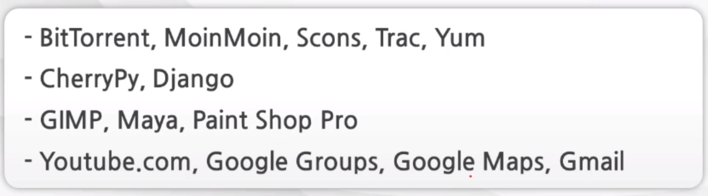

### Python 이란?
- <b>파이썬</b>
    - 1991년 귀도 반 로썸이 발표
    - 특징
        - 가독성 높음(간결, 코드 block을 들여쓰기로 구분)
        - 풍부한 Library
        - 접착성 : 간단하게 library 추가, C로 구현된 부분 사용 가능
        - 무료
        - 유니코드 : 문자열 모두 유니코드
        - 동적타이핑 : 런타임 시에 타입 체크 하는 동적타이핑 지원, 메모리 관리 자동
- <b>파이썬의 종류</b>
    - Cpython
        - C로 구성된 Python
    - Jython
        - 자바로 구성된 Python
        - 자바 가상 머신에서 구동 가능
        - 자바 library를 지원함
    - IronPython
        - .NET용으로 C#으로 구현된 Python
    - Pypy
        - Python 으로 구현된 Python
- <b>파이썬으로 진행된 Project</b>
    - 
- <b>파이썬의 Version</b>
    - 2.x style
        - print
            - ex) print "welcome to", ---
        - int/int가 int의 결과로 반영되었음
        - String, Unicode로 구분
    - 3.x style
        - 2 version과의 호환성이 전혀 없음
        - print가 함수형태로 변경
            - ex) print("welcome")
        - long 자료형이 없어지고 int형으로 통일
        - int/int의 결과가 float으로 처리됨.
        - String / bytes로 구분(Unicode를 따로 지정하지 않고 일반 String이 기존 Unicode)
- <b>파이썬의 문법</b>
    - 들여쓰기(indentation)
        - 가독성을 높일 수 있음. 그러나 오류가 발생하지 않도록 주의
        - 예약어 아래에 같은 구문 시, 예약어 뒤에 (:) 사용하여 구분
            - <pre><code>for i in Python: 
                &#32; &#32;print(i)
              </code></pre>
    - 주석(#)
        - ```-*- coding: utf-8-*-```
        - 위와 같이 사용 시, 소스코드 인코딩 지정하는 용도로 사용
    - 세미콜론(;)
        - 한 line에 복수의 구문 시 사용. 
            - ```a=1; b=2```
- <b>자료형과 연산자</b>
    - 자료형?
        - 프로그램이 연산을 수행하기 위해 임시로 저장한 저장소를 변수라고 하며 이 변수의 유형이 자료형
        - 수치형, 문자형, 리스트형, 튜플형, 사전(Dictionary)형, 부울형이 있다.
        - 변수?
            - 문자 / 숫자 / 밑줄(_)로 구성되며 예약어는 사용 불가하고, 대소문자를 구분하며 숫자를 먼저 대어 이름을 지을 수 없다.
        - 수치형
            - int와 float, complex가 있으며 int는 정수, float는 소수
            - int는 숫자 앞에 0x는 16진수, 0o는 8진수, 0b는 2진수이다.
            - float는 3.14또는 314e-2 지수형으로 표현할 수 있다.
            - complex는 복소수이며 imag는 허수부, real은 실수부, conjugate()는 켤레 복소수를 나타낸다.
        - 문자형
            - '', "", """ """ 등으로 사용 가능하며 기본적으로 유니코드이다. 유니코드 이외의 인코딩 시 bytes로 표현된다.
                - <pre><code>type('가'.encode('utf-8'))</code></pre>의 class type은 bytes이다.
            - Escape 문자 사용하여 표현 가능
                - 
            - +를 통해 문자열을 잇거나 *를 통해 반복화할 수 있다.
            - 인덱싱, 슬라이싱 또한 가능하다.
                - 'python'[0], 'python'[5], 'python'[1:4], 'python'[-2:] 등을 통해 특정 부분을 나타낼 수 있다.
        - 리스트형
            - 값의 나열과 같으며, 인덱싱, 슬라이싱이 가능하다.
            - 예) ['red', 'green', 'gold', 'black']
            - 특정 index에 추가하거나 확장할 수 있다.(insert, append, extend, +)
            - count를 통해 list의 개수를 알 수 있고 pop을 이용해 값을 뽑아내거나 remove로 삭제, sort로 정렬 가능
        - 세트
            - 값의 모임이며, 순서가 없다. 제공 메소드는 리스트와 유사하고 추가적으로 교집합(intersection)/합집합(union)이 제공된다.
        - 튜플
            - 리스트와 유사하나 읽기 전용이다. 읽는 속도는 빠르다. 제공되는 함수는 적다.
            - 자주 사용되는 것은 count, index 정도이다.
            - 리스트, 세트, 튜플은 상호간 생성자를 통해 변환 가능
        - 딕셔너리(사전)
            - 키 : 값의 쌍으로 이루어져 있다.
            - 예 : {'a' : 1, 'b' : 2, 'c' : 3}
            - items(), keys(), values() 메소드를 통해 키/값, 키, 값을 각각 반환할 수 있다.
            - del문을 이용해 삭제하거나 clear()를 통해 전체 삭제 가능
        - bool(부울)
            - True, False만 가능한 참 거짓 자료형
            - 논리연산 / 비교 연산의 결과로 활용한다.
            - 논리 연산자는 &, |, not이 있다. 비교는 >, <, !=, == 등이 있다.
            - 0은 false이며 다른 숫자는 true. 빈 문자열은 false, 값이 없는 상태인 공란도 false
    - 연산자
        - +,-,*,/,//,%,**,= 등이 있으며 //는 몫만 남기는 방식, **는 거듭제곱
    - 얕은 복사 vs 깊은 복사
        - 변수에는 객체의 주소가 저장된다.
        - 얕은 복사
            - a = [1,2,3], b=a 라고 한다면 동일한 리스트 객체를 공유하여 id(a), id(b)의 값은 동일하다.
            - 즉, 주소가 복사되어 객체를 공유하는 경우를 의미한다.
        - 깊은 복사
            - 객체를 공유하지 않는 복사 방식이다.
            - a = [1,2,3], b=a[:]라고 한다면 각각의 id값은 다르다. 이 때, a list내 element 값을 변경한다면 b는 변경되지 않는다.